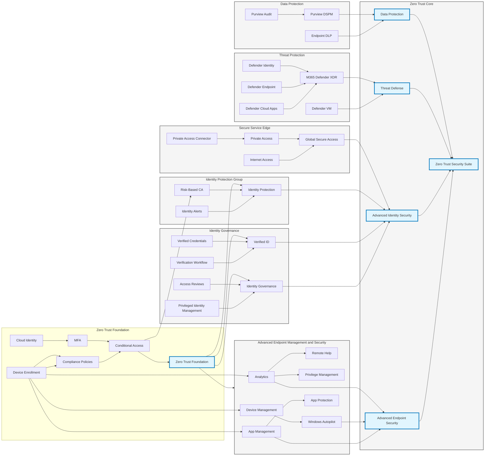

```mermaid        
           
            flowchart LR
                %% Define core components with clear labels
                    subgraph Core["Zero Trust Core"]
                    Zero["Zero Trust Security Suite"]
                    Data["Data Protection"]
                    Threats["Threat Defense"]
                    SecureID["Advanced Identity Security"]
                    IntuneSuite["Advanced Endpoint Security"]
                    end

                %% Core relationships
                    Data --> Zero
                    Threats --> Zero
                    SecureID --> Zero
                    IntuneSuite --> Zero

                %% Group Data Security components
                        subgraph DataProtection["Data Protection"]
                        direction TB
                        DSPM["Purview DSPM"]
                        EndpointDLP["Endpoint DLP"]
                        PurAud["Purview Audit"]
                        end
                DSPM --> Data
                EndpointDLP --> Data
                PurAud --> DSPM

                %% Group Threat Protection components
                subgraph ThreatProtection["Threat Protection"]
                    direction TB
                    XDR["M365 Defender XDR"]
                    DID["Defender Identity"]
                    MDE["Defender Endpoint"]
                    MDCA["Defender Cloud Apps"]
                    MDVM["Defender VM"]
                end
                XDR --> Threats
                DID --> XDR
                MDE --> XDR
                MDCA --> XDR
                MDVM --> Threats

                %% Group Foundation components
                subgraph Foundationcomponents["Zero Trust Foundation"]
                    direction TB
                    Foundation["Zero Trust Foundation"]
                    CloudID["Cloud Identity"] --> MFA["MFA"]
                    MFA --> CA["Conditional Access"]
                    IntuneEnroll["Device Enrollment"] --> IntuneCompPol["Compliance Policies"]
                    IntuneCompPol --> CA
                    CA --> Foundation
                end
                Foundation --> VID
                Foundation --> IDProtection
                Foundation --> IGA
                Foundation --> EndpointManagement

                %% Group Network Access components
                subgraph NetworkAccess["Secure Service Edge"]
                    direction TB
                    EPA["Private Access"]
                    EPAConn["Private Access Connector"]
                    GSA["Global Secure Access"]
                    EIA["Internet Access"]
                end
                EPAConn --> EPA
                EPA --> GSA
                GSA --> SecureID
                EIA --> GSA

                %% Group Identity Protection components
                subgraph IdentityProtectiongroup["Identity Protection Group"]
                    RCA["Risk-Based CA"] --> IDProtection["Identity Protection"]
                    IDProtAlerts["Identity Alerts"] --> IDProtection                                   
                end
                CA --> RCA
                IDProtection --> SecureID

                %% Group Identity Governance components
                subgraph IdentityGovernance["Identity Governance"]
                    direction TB
                    VIDCred["Verified Credentials"]
                    VIDWorkflow["Verification Workflow"]
                    VID["Verified ID"]
                    AccessReview["Access Reviews"]
                    IGA["Identity Governance"]
                    PIM["Privileged Identity Management"]
                end
                VIDCred --> VID
                VIDWorkflow --> VID
                VID --> SecureID
                AccessReview --> IGA
                PIM --> IGA
                IGA --> SecureID

                %% Group Endpoint Management components
                subgraph EndpointManagement["Advanced Endpoint Management and Security"]
                    direction TB
                    EndpointAnalytics["Analytics"]
                    RemoteHelp["Remote Help"]
                    EPM["Privilege Management"]
                    SpecializedDevices["Device Management"]
                    AutoPilot["Windows Autopilot"]
                    AppManagement["App Management"]
                    AppProtection["App Protection"]
                end
                IntuneEnroll --> IntuneCompPol
                IntuneEnroll --> EndpointAnalytics
                EndpointAnalytics --> RemoteHelp
                EndpointAnalytics --> EPM
                IntuneEnroll --> SpecializedDevices
                SpecializedDevices --> AutoPilot
                IntuneEnroll --> AppManagement
                AppManagement --> AppProtection
                EndpointAnalytics --> IntuneSuite
                AutoPilot --> IntuneSuite
                AppManagement --> IntuneSuite

                %% Styling
                classDef deployed fill:#90EE90,stroke:#333,stroke-width:2px
                classDef notDeployed fill:#FFB6C1,stroke:#333,stroke-width:2px
                classDef subgraphStyle fill:#f5f5f5,stroke:#666,stroke-width:2px
                classDef core fill:#e1f5fe,stroke:#0277bd,stroke-width:3px

                %% Apply styles
                class Core,DataProtection,ThreatProtection,IdentityProtection,NetworkAccess,IdentityGovernance,EndpointManagement,IdentityProtectiongroup,IdentityGovernance, subgraphStyle
                class Zero,Foundation,Data,Threats,SecureID,IntuneSuite core

```
