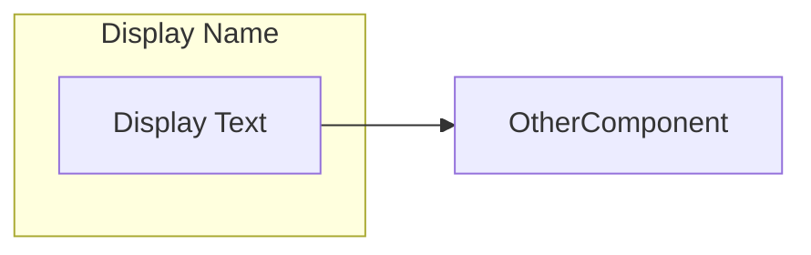

# Security Deployment Guidance Tool

The content in this repository is not meant as reference. It is experimentation with different formats for presenting deployment guidance for Microsoft's suite of security products.

## Content Structure

The tool consists of three main content files:
- `index.html` - Contains the questions and core application logic
- `recommendations.md` - Contains all recommendations organized by phases
- `DetailedDiagram.md` and `SimplifiedDiagram.md` - Contain the Mermaid diagram definitions

## How to Edit Content

### Editing Questions
Questions are defined in the `index.html` file within the `questions` array. Each question has this structure:
```javascript
{
    id: 'UniqueID',      // Must match IDs used in diagrams and recommendations
    text: 'Question text shown to user?',
    description: 'Additional explanation of the question',
    docLink: 'https://learn.microsoft.com/...'  // Reference documentation
}
```

To add or remove questions:
1. Edit the `questions` array in `index.html`
2. Ensure the question ID matches corresponding elements in the diagrams and recommendations
3. Provide a clear description and relevant documentation link

### Editing Recommendations
Recommendations are stored in `recommendations.md` and organized by implementation phases:

```markdown
### Key Resources
- [Resource links]

## First 30 Days: Foundation and Quick Wins {#phase1}
### Component Name {#UniqueID}
- Recommendation content
- Implementation steps
- Reference: [Documentation link]

## Days 31-60: Enhanced Security Features {#phase2}
...
```

To edit recommendations:
1. Maintain the phase structure with `{#phase1}`, `{#phase2}`, etc.
2. Use component IDs that match the questions and diagrams `{#UniqueID}`
3. Include clear implementation steps and documentation links
4. Group recommendations in appropriate phases

### Editing Diagrams
Diagrams are defined in `DetailedDiagram.md` and `SimplifiedDiagram.md` using Mermaid flowchart syntax:



To edit diagrams:
1. Use consistent component IDs that match questions and recommendations
2. Maintain the style definitions for deployed/not deployed states
3. Group related components using subgraphs
4. Include documentation links using click events
5. Test diagram rendering using the [Mermaid Live Editor](https://mermaid.live)

### Important Notes
- Component IDs must be consistent across all files
- Each component should appear in only one phase in the recommendations
- The detailed diagram structure determines which phase a component belongs to
- Maintain all style definitions when editing diagrams
- Test changes thoroughly as files are interconnected

### File Dependencies
- Questions (index.html) → Define components and their IDs
- Diagrams (.md) → Show relationships and grouping
- Recommendations (.md) → Provide implementation guidance by phase

## Testing Changes
1. Test locally using a web server (e.g., `python -m http.server`)
2. Verify all components are properly linked
3. Check that recommendations appear in correct phases
4. Ensure diagrams update correctly based on responses
5. Validate all documentation links
