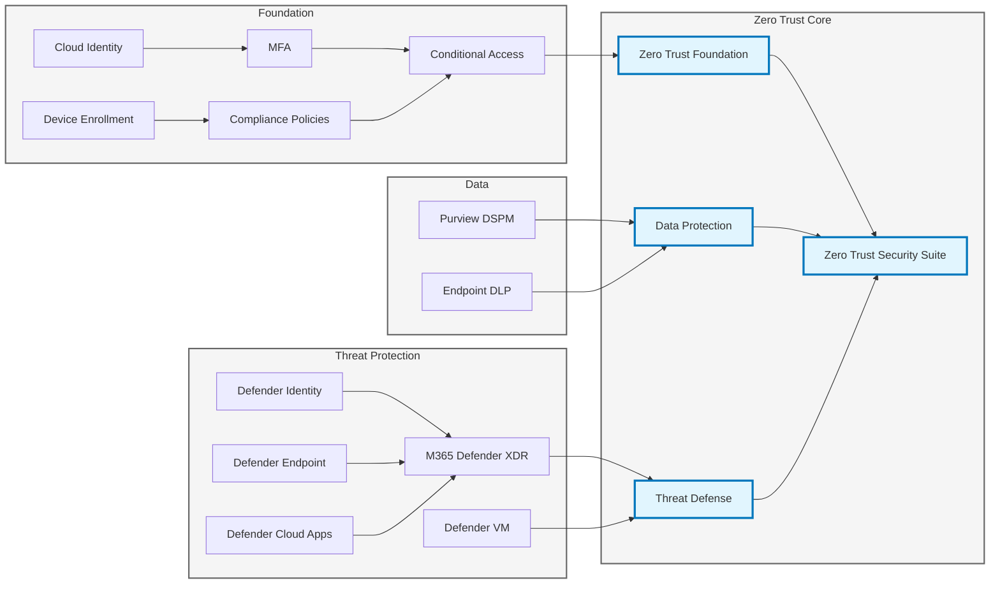

```mermaid       
            flowchart LR
                %% Core components
                subgraph Core["Zero Trust Core"]
                    Zero["Zero Trust Security Suite"]
                    Foundation["Zero Trust Foundation"]
                    Data["Data Protection"]
                    Threats["Threat Defense"]
                end

                %% Core relationships
                Foundation --> Zero
                Data --> Zero
                Threats --> Zero

                %% Key Components
                subgraph KeyIdentity["Foundation"]
                    CloudID["Cloud Identity"]
                    MFA["MFA"]
                    CA["Conditional Access"]
                    IntuneEnroll["Device Enrollment"]
                    IntuneCompPol["Compliance Policies"]
                end
                CloudID --> MFA
                MFA --> CA
                CA --> Foundation
                IntuneEnroll --> IntuneCompPol
                IntuneCompPol --> CA


                subgraph KeySecurity["Threat Protection"]
                    XDR["M365 Defender XDR"]
                    MDVM["Defender VM"]
                    DID["Defender Identity"]
                    MDE["Defender Endpoint"]
                    MDCA["Defender Cloud Apps"]
                end
                DID --> XDR
                MDE --> XDR
                MDCA --> XDR
                XDR --> Threats
                MDVM --> Threats

                subgraph KeyData["Data"]
                    DSPM["Purview DSPM"]
                    EndpointDLP["Endpoint DLP"]
                end
                DSPM --> Data
                EndpointDLP --> Data

                %% Styling
                classDef deployed fill:#90EE90,stroke:#333,stroke-width:2px
                classDef notDeployed fill:#FFB6C1,stroke:#333,stroke-width:2px
                classDef subgraphStyle fill:#f5f5f5,stroke:#666,stroke-width:2px
                classDef core fill:#e1f5fe,stroke:#0277bd,stroke-width:3px

                %% Apply styles
                class Core,KeyIdentity,KeyEndpoint,KeySecurity,KeyData subgraphStyle
                class Zero,Foundation,Data,Threats,SecureID,IntuneSuite core

```